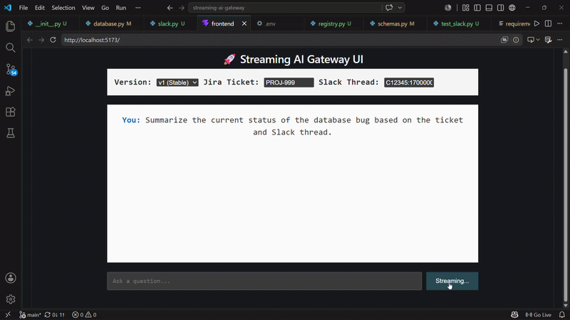
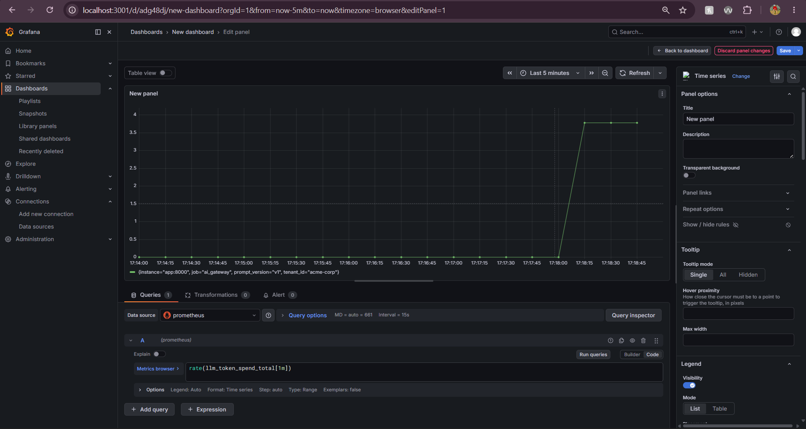

# 🚀 Streaming AI Gateway


An enterprise-grade, dual-transport (REST + gRPC) AI Gateway designed for high-performance LLM streaming, real-time context injection, and strict data privacy.

## ✨ The "Wow" Factor: Dynamic Context Injection

_Below is a demonstration of the gateway streaming tokens in real-time while dynamically intercepting a Slack/Jira reference, securely fetching the context, and injecting it into the LLM prompt._



---

## 🏗️ Architecture

```mermaid
graph TD
    %% Define Styles
    classDef client fill:#2a9d8f,stroke:#264653,stroke-width:2px,color:#fff;
    classDef core fill:#e9c46a,stroke:#e76f51,stroke-width:2px;
    classDef external fill:#f4a261,stroke:#e76f51,stroke-width:2px,color:#fff;
    classDef db fill:#264653,stroke:#2a9d8f,stroke-width:2px,color:#fff;

    %% Nodes
    Client((Client App / UI)):::client
    Gateway[FastAPI Dual-Transport Gateway<br/>REST & WebSockets]:::core
    Auth{JWT Auth Middleware}:::core
    Cache[(Redis Semantic Cache)]:::db
    Registry[Prompt Registry<br/>Active / Canary Router]:::core
    Connectors[Enterprise Connectors]:::core
    PII[Microsoft Presidio<br/>PII Redaction]:::core
    LLM((Groq / Llama-3 API)):::external
    Slack[Slack API]:::external
    Jira[Jira API]:::external
    DB[(PostgreSQL Audit Log)]:::db
    Prom[Prometheus]:::db
    Grafana[Grafana]:::db

    %% Flow
    Client -->|POST /chat/stream| Gateway
    Gateway -->|Validate Token| Auth
    Auth -->|Authorized| Cache

    Cache -.->|Cache Hit <br/> Cosine Sim > 0.92| Client

    Cache -->|Cache Miss| Registry
    Registry -->|Extract References| Connectors

    Connectors -->|Fetch| Slack
    Connectors -->|Fetch| Jira
    Slack & Jira -->|Raw Context| PII
    PII -->|Scrubbed Context| Registry

    Registry -->|Inject Context & Prompt| LLM
    LLM -->|Stream Tokens| Gateway

    %% Background Tasks
    Gateway -.->|Async Save| Cache
    Gateway -.->|Async Append| DB

    %% Observability
    Gateway -.->|Scrape Metrics| Prom
    Prom -.->|Visualize| Grafana
⚡ Quickstart (Run in < 2 Minutes)
You only need Docker installed to run the entire stack (Database, Cache, API Gateway, and UI).

Clone the repo and set up your environment:

Bash
git clone [https://github.com/sahej009/streaming-ai-gateway.git](https://github.com/sahej009/streaming-ai-gateway.git)
cd streaming-ai-gateway
# Add your Groq/OpenAI key to a .env file
echo "GROQ_API_KEY=your_key_here" > .env
Boot the architecture:

Bash
docker compose up -d --build
Access the Application:

Chat UI: http://localhost:3000

API Docs (Swagger): http://localhost:8000/docs

Grafana Dashboards: http://localhost:3001 (Update to your Grafana port if applicable)

🛠️ Core Enterprise Features
Dual-Transport Streaming: Streams tokens directly from the LLM to the client via Server-Sent Events (SSE) and WebSockets.

Semantic Caching: Uses HuggingFace embeddings (all-MiniLM-L6-v2) and Redis to instantly return cached answers for semantically similar questions, saving API costs and reducing latency.

Dynamic Prompt Routing (Canary Deployments): Routes traffic between different YAML-defined prompt versions (v1 and v2) on the fly, allowing for safe A/B testing of system prompts.

Enterprise Context Connectors: Automatically intercepts Jira ticket IDs and Slack threads, fetches the data asynchronously, and injects it into the prompt context.

On-the-Fly PII Redaction: Routes all fetched enterprise context through Microsoft Presidio to scrub personally identifiable information (emails, phone numbers, names) before it hits the external LLM.

Append-Only Audit Logging: Silently records every interaction, token spend, and latency metric into a PostgreSQL database without blocking the streaming hot-path.

Full Observability: Instrumented with Prometheus and Grafana for real-time tracking of token spend, cache hit rates, and streaming latency.

📊 Observability & Metrics
The gateway tracks LLM token spend, request latency, and cache efficiency in real-time.

```
