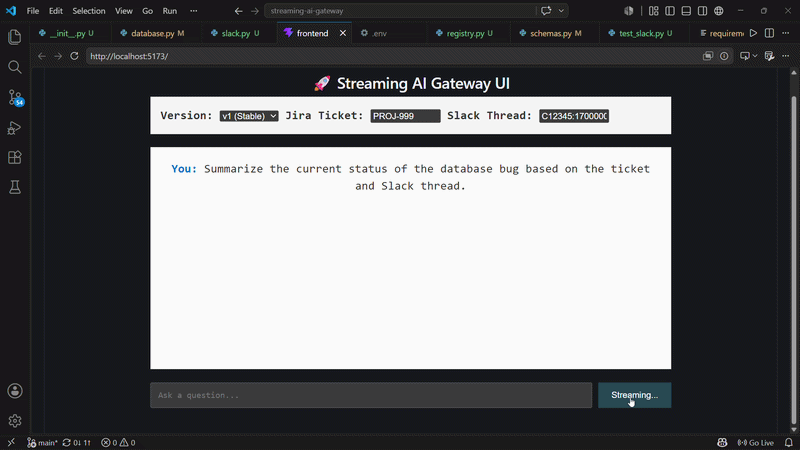
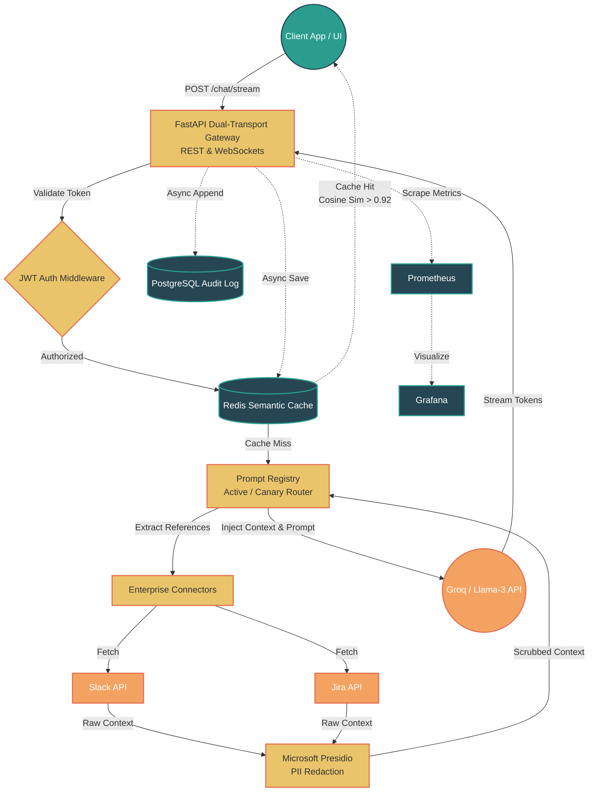

# 🚀 Streaming AI Gateway


An enterprise-grade, dual-transport (REST + gRPC) AI Gateway designed for high-performance LLM streaming, real-time context injection, and strict data privacy.

## ✨ The "Wow" Factor: Dynamic Context Injection

_Below is a demonstration of the gateway streaming tokens in real-time while dynamically intercepting a Slack/Jira reference, securely fetching the context, and injecting it into the LLM prompt._



---

## 🏗️ Architecture


```mermaid
graph TD
    classDef client fill:#2a9d8f,stroke:#264653,stroke-width:2px,color:#fff;
    classDef core fill:#e9c46a,stroke:#e76f51,stroke-width:2px;
    classDef external fill:#f4a261,stroke:#e76f51,stroke-width:2px,color:#fff;
    classDef db fill:#264653,stroke:#2a9d8f,stroke-width:2px,color:#fff;

    Client((Client App / UI)):::client
    Gateway[FastAPI Dual-Transport Gateway<br/>REST & WebSockets]:::core
    Auth{JWT Auth Middleware}:::core
    Cache[(Redis Semantic Cache)]:::db
    Registry[Prompt Registry<br/>Active / Canary Router]:::core
    Connectors[Enterprise Connectors]:::core
    PII[Microsoft Presidio<br/>PII Redaction]:::core
    LLM((Groq / Llama-3 API)):::external
    Slack[Slack API]:::external
    Jira[Jira API]:::external
    DB[(PostgreSQL Audit Log)]:::db
    Prom[Prometheus]:::db
    Grafana[Grafana]:::db

    Client -->|POST /chat/stream| Gateway
    Gateway -->|Validate Token| Auth
    Auth -->|Authorized| Cache
    Cache -.->|Cache Hit <br/> Cosine Sim > 0.92| Client
    Cache -->|Cache Miss| Registry
    Registry -->|Extract References| Connectors
    Connectors -->|Fetch| Slack
    Connectors -->|Fetch| Jira
    Slack & Jira -->|Raw Context| PII
    PII -->|Scrubbed Context| Registry
    Registry -->|Inject Context & Prompt| LLM
    LLM -->|Stream Tokens| Gateway
    Gateway -.->|Async Save| Cache
    Gateway -.->|Async Append| DB
    Gateway -.->|Scrape Metrics| Prom
    Prom -.->|Visualize| Grafana

```

---

Markdown## ⚡ Quickstart (Run in < 2 Minutes)

```bash

git clone https://github.com/sahej009/streaming-ai-gateway.git
cd streaming-ai-gateway
echo "GROQ_API_KEY=your_key_here" > .env
Bashdocker compose up -d --build
Access the Application:Chat UI: http://localhost:3000API Docs (Swagger): http://localhost:8000/docsPrometheus Metrics: http://localhost:8000/metricsGrafana Dashboards: http://localhost:3001


🛠️ Core Enterprise FeaturesDual-Transport Streaming: 
Streams tokens directly from the LLM to the client via Server-Sent Events (SSE) and WebSockets.Semantic Caching (~92% Latency Reduction): Uses HuggingFace embeddings (all-MiniLM-L6-v2) and Redis to instantly return cached answers for semantically similar questions, saving API costs and reducing median latency from 835 ms down to 64 ms.
Dynamic Prompt Routing (Canary Deployments): Routes traffic between different YAML-defined prompt versions (v1 and v2) on the fly, allowing for safe A/B testing of system prompts.
Enterprise Context Connectors: Automatically intercepts Jira ticket IDs and Slack threads, fetches the data asynchronously, and injects it into the prompt context.

On-the-Fly PII Redaction: Routes all fetched enterprise context through Microsoft Presidio to scrub personally identifiable information (emails, phone numbers, names) before it hits the external LLM.
Append-Only Audit Logging: Silently records every interaction, token spend, and latency metric into a PostgreSQL database without blocking the streaming hot-path.Full Observability: Instrumented with Prometheus and Grafana for real-time tracking of token spend (llm_token_spend_total), cache hit rates (cache_hits_total), and streaming latency (llm_request_latency_seconds) across tenant_id and prompt_version labels.

📊 Observability & Load-Testing Metrics
The gateway tracks LLM token spend, request latency, and cache efficiency in real time and was stress-tested under 50-user concurrency using Locust (tests/locustfile.py):MetricBaseline (Cached Routing)50-User Stress TestEngineering ImpactMedian Latency (p50)64 ms (18 ms min)630 ms~92% latency reduction via Redis semantic cacheTail Latency (p95)94 ms1,300 msSub-100ms p95 routing for cached queriesThroughput4.4 RPS18.9 RPS (~1,130 req/min)Sustained high-concurrency SSE streamingStreamed Requests5951,8090% Failure Rate (0 dropped streams)
Once you paste that below your `## 🏗️ Architecture` block and save `README.md`,
run:

```powershell
git add README.md
git commit -m "docs(readme): format feature headers and add Locust benchmark metrics"
git push origin main
